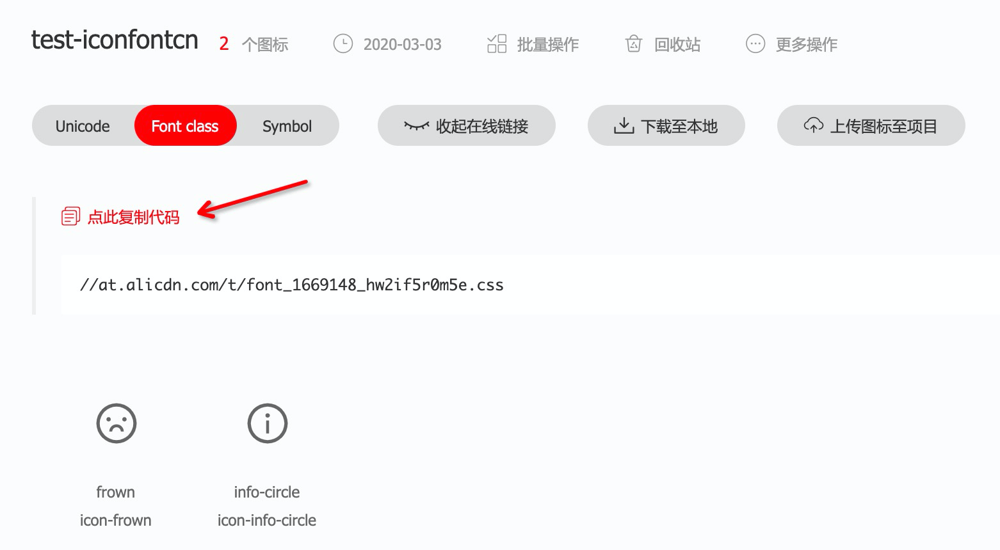

# offline-iconfont

An util to help you download fonts and assets from [iconfont.cn](http://iconfont.cn/)

[](https://www.npmjs.com/package/offline-iconfont)
[](https://www.npmjs.com/package/offline-iconfont)
[](https://circleci.com/gh/vagusx/offline-iconfont)

## Installation

```bash
$ npm install offline-iconfont

# or use yarn
$ yarn add offline-iconfont
```

## Usage

```js
const download = require('offline-iconfont')

(async () => {
  await download({
    cssUrl: '//at.alicdn.com/t/font_1231231.css', // your iconfont.cn project url
    dir,
    extnameList: ['svg', 'eot'],
    cssOffline: false
  })
})()
```

## Options

```ts
function OfflineIconfont(config: OfflineIconfontConfig): void;

interface OfflineIconfontConfig {
  /**
   * css url from your iconfont.cn project
   */
  cssUrl: string;
  /**
   * where to locate font assets
   * @default process.cwd()
   */
  dir?: string;
  /**
   * file name for font asset
   * @default 'iconfont'
   */
  filename?: string;
  /**
   * replace font asset path to local relative path
   * @default true
   */
  cssOffline?: boolean;
  /**
   * specify which file to download
   */
  extnameList?: string[];
}
```

## Find your [iconfont.cn](http://iconfont.cn/) project url



[](https://github.com/feross/standard)
